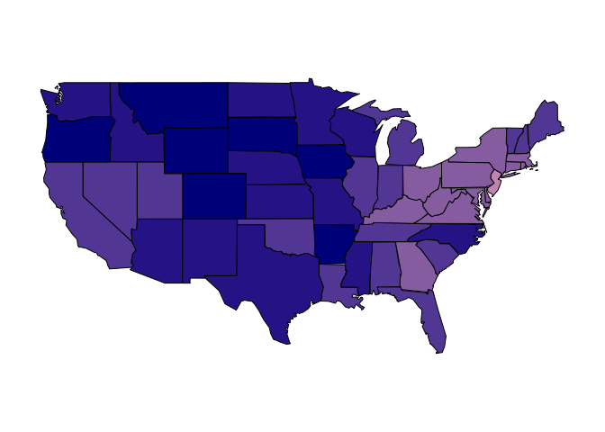
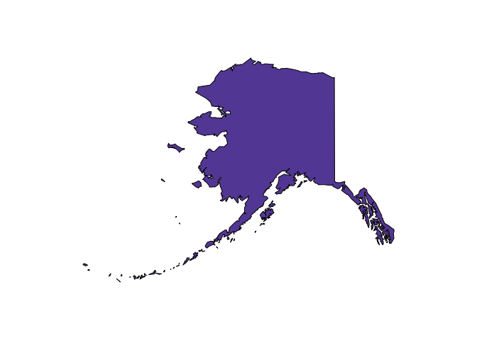

Source - National Center for Chronic Disease Prevention and Health Promotion | Division of Population Health

Behavioral Risk Factor Surveillance System (BRFSS) *<http://www.cdc.gov/sleep/data_statistics.html>*

Plotting Alaska, Hawaii *<https://gregorybooma.wordpress.com/2013/01/05/map-of-the-united-states-including-alaska-and-hawaii-with-r/>*

``` r
library(maps)
library(mapdata)
library(Hmisc)
```

    ## Warning: package 'Hmisc' was built under R version 3.1.3

    ## Loading required package: grid
    ## Loading required package: lattice
    ## Loading required package: survival
    ## Loading required package: splines
    ## Loading required package: Formula

    ## Warning: package 'Formula' was built under R version 3.1.3

    ## Loading required package: ggplot2

    ## Warning: package 'ggplot2' was built under R version 3.1.3

    ## 
    ## Attaching package: 'Hmisc'
    ## 
    ## The following objects are masked from 'package:base':
    ## 
    ##     format.pval, round.POSIXt, trunc.POSIXt, units

``` r
setwd('~/Documents/IM Vault/IST 719/Poster/Sample Dataset/Sleeping/')
df2014 <- sasxport.get('BRFSS/2014/LLCP2014.XPT', as.is = TRUE)
```

    ## Processing SAS dataset LLCP2014   ..

``` r
df2014 <- df2014[,c('x.state', 'sleptim1', 'x.age.g', 'x.race', 'x.rfdrhv4', 'sex', 'smokday2',
                    'exerany2', 'genhlth', 'physhlth', 'menthlth')]

stateMapping <- read.csv('BRFSS/StateMapping.csv', stringsAsFactors = F)
df2014 <-  subset(df2014, x.state != 66 & x.state != 72)
df2014 <- merge(df2014, stateMapping, by = 'x.state')
df2014 <- subset(df2014, sleptim1 <=24)

map('state')
```


``` r
#state average - Give full state's name for state map
#convert HR to Min -> precision
df2014$sleptim1_min <- df2014$sleptim1 *60
state_avg <- aggregate(df2014[, 'sleptim1_min'], list(df2014$State), mean)
state_avg <- state_avg[state_avg$Group.1!='DC', ]
state_avg <- state_avg[state_avg$Group.1!='AK', ]

# start here for map plotting - find workaround to add HI and AK
# values <- runif(length(state.abb),0,1)
range <- (max(state_avg$x) - min(state_avg$x))  #expanding value frame -> 23 minutes different
values <- (state_avg$x - min(state_avg$x)) * 2.5
values <- (state_avg$x - min(state_avg$x)) / range  # 0...1
values <- (state_avg$x - min(state_avg$x))

valueLabel <- c(1:length(values))
for (i in 1:length(values)) {
  if(values[i]<5) valueLabel[i] <- .2
  else if(values[i]<10) valueLabel[i] <- .4
  else if(values[i]<15) valueLabel[i] <- .6
  else if(values[i]<20) valueLabel[i] <- .8
  else valueLabel[i] <- 1
}
names(valueLabel) <- state_avg$Group.1
names(values) <- state_avg$Group.1
```

getting the names used by map

``` r
tmp <- map('state',plot=FALSE,namesonly=TRUE )
#matching (after adjusting using gsub and tolower)
tmp <- match(gsub('(:.*)','',tmp),c(tolower(state_avg$Group.1)))
#convert your numbers to grey-scale and selct using the match
map('state',fill=TRUE,col=rgb(colorRamp(c('pink','darkblue'))(valueLabel), max=255)[tmp])
```



plot Alaska

``` r
tmp <- map('world2Hires', "USA:Alaska",plot=FALSE,namesonly=TRUE )
# matching (after adjusting using gsub and tolower)
tmp <- match('alaska',c(tolower(state_avg$Group.1)))
# convert your numbers to grey-scale and selct using the match
map("world2Hires", "USA:Alaska", fill = TRUE, col=rgb(colorRamp(c('pink','darkblue'))(valueLabel),max=255)[tmp])
```



plot Hawaii

``` r
tmp <- map('world2Hires', "Hawaii",plot=FALSE,namesonly=TRUE )
# matching (after adjusting using gsub and tolower)
tmp <- match('hawaii', c(tolower(state_avg$Group.1)))
# convert your numbers to grey-scale and selct using the match
map("world2Hires", "Hawaii", fill = TRUE, col=rgb(colorRamp(c('pink','darkblue'))(valueLabel),max=255)[tmp])
```


